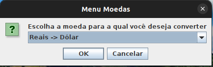

# Conversor

# Sobre o projeto

Conversor de Moeda e Temperatura. Converte valores de diferentes moedas e escalas de temperatura.

### Funcionalidades conversor de moeda

- Conversão de Reais para Dólares
- Conversão de Reais para Euros
- Conversão de Reais para Libras
- Conversão de Reais para Yenes
- Conversão de Reais para Won Coreano
- Conversão de Dólares para Reais
- Conversão de Euros para Reais
- Conversão de Libras para Reais
- Conversão de Yenes para Reais
- Conversão de Won Coreano para Reais

### Funcionalidades conversor de temperatura

- Conversão de Celsius para Fahrenheit
- Conversão de Celsius para Kelvin
- Conversão de Fahrenheit para Celsius
- Conversão de Fahrenheit para Kelvin
- Conversão de Kelvin para Fahrenheit
- Conversão de Kelvin para Celsius

## Layout





# Tecnologias utilizadas

- Java 
- Java Swing

# Como executar o projeto

### Pré-requisitos: Java 8 ou superior

```bash 
    # clonar repositório
    https://github.com/claudio-sr/conversor
    
    Execute o arquivo principal do projeto para iniciar o programa.
```

# Autor

Claudio Rodrigues

https://www.linkedin.com/in/jose-claudio-rodrigues/


